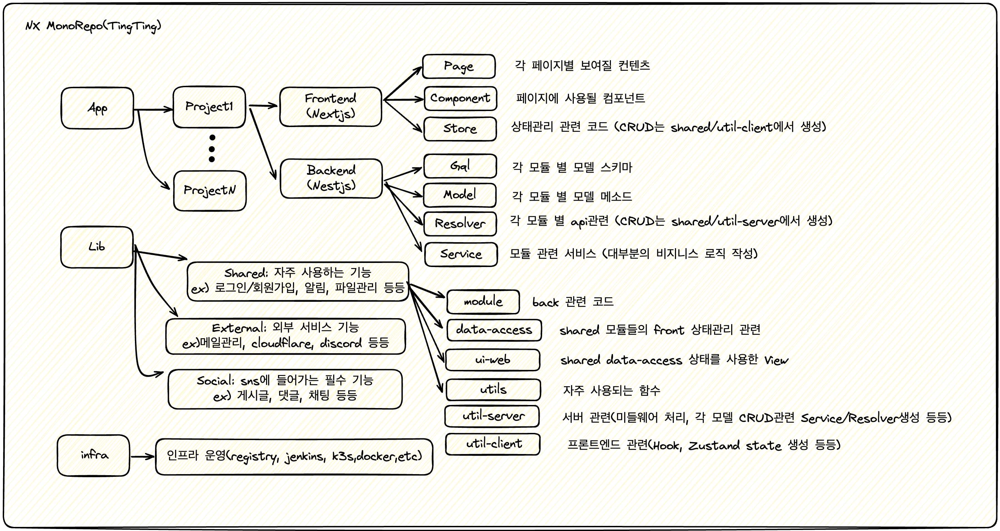

# TingTing

이 모노리포는 TingTing의 일부 소스코드를 포함하고 있습니다.

## Prerequisite

본 프로젝트를 사용하기 위해서는, 사전에 junnncho@gmail.com 에게 협의해야 합니다.

## Get Started

Run the code below.

```
npm run downloadEnv # Need to register your public key

npm i -g pnpm

pnpm install -w


cat <<EOF >> .env
# ENV For Server => local | debug | develop | main
SERVER_ENV=debug
# Run Mode For Server => federation | batch | all
SERVER_MODE=federation
# ENV For Client => local | debug | develop | main
CLIENT_ENV=debug.local
ANALYZE=false
EOF

nx serve tingting/backend
# or nx serve tingting/frontend, etc
```

## Roadmap

TingTing 레포의 목적은 다양한 웹/앱서비스들이 손쉽고 빠르게 제작할 수 있도록 합니다.


## Contributors

To contribute this project, contact junnncho@gmail.com
