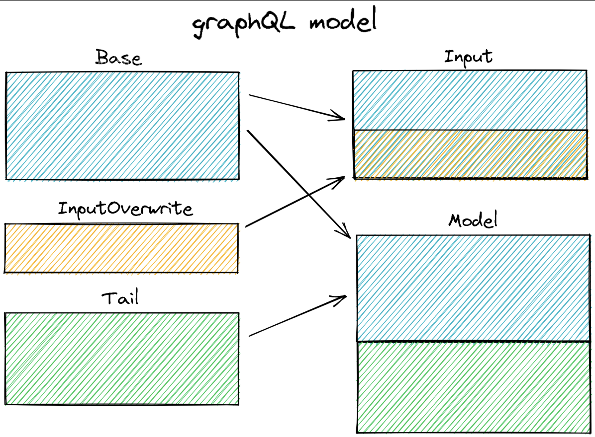

# GraphQL이란?

[소개 영상](https://www.youtube.com/watch?v=N-81mS2vldI)

# TingTing GraphQL 모델 구조

graphQL 모델링은 세 가지로 나누어 설계를 진행함.

- Base: 데이터 생성하는 데 필요한 재료
- InputOverwrite: 데이터 생성 시 변형되는 부분의 정보
- Tail: 데이터 생성 시 자동생성되며, 이후에 별도 업데이트를 통해서만 변경되는 정보(보안적 필드 등)

### 작동 예시

CRUD 프로세스

- Base + InputOverwrite 데이터를 기반으로 CreateModel을 진행
- Create된 데이터의 형태는 Base + Tail의 형태
- UpdateModel 시 Base부분만이 업데이트가 가능
- status는 Tail 필드이며, 이를 업데이트하기 위해서는 removeModel을 통해 데이터를 업데이트

# [모델 구현 예시](../../libs/shared/module/src/keyring/keyring.gql.ts)
