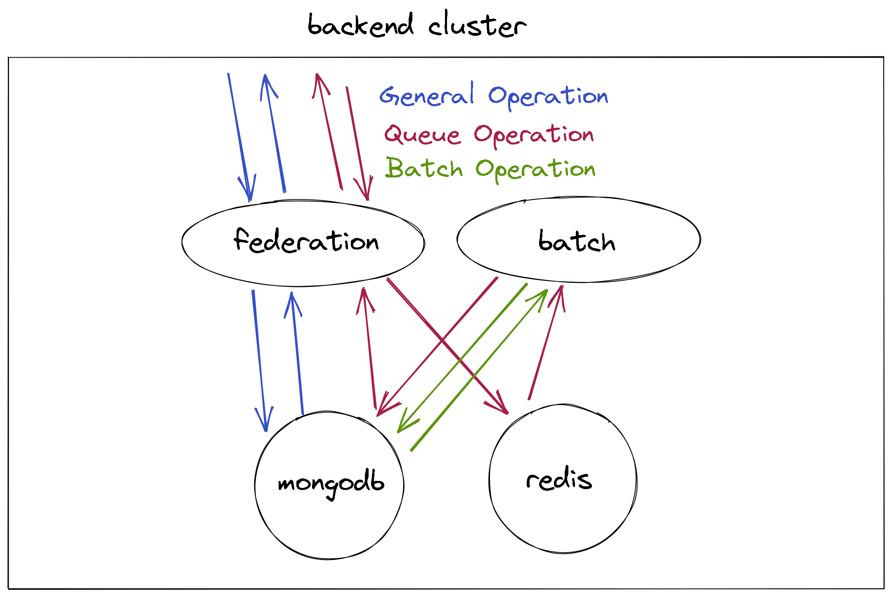

# 백엔드 시스템의 구조

백엔드 시스템은 다음과 같이 4개의 요소로 구성되어있음.

- [federation 서버](): Stateless하며, 여러 개를 복제해서 요청을 처리하는 서버
- [batch 서버](): 주기적 또는 Queue요청에 맞게 작업을 처리하는 서버
- [mongodb 서버](): Stateful하며, 데이터를 저장하는 서버
- [redis 캐시서버](): 캐시와 큐 작업을 위한 임시 데이터 저장 서버

## 작동 방식

서버의 작동 과정은 크게 General, Queue, Batch 세가지 작업을 진행함.

- Query: 특정 데이터를 조회하거나 수정하는 작업, 주로 클라이언트에서 요청을 보냄.
- Queue: 작업이 겹치거나 문제가 생기면 안되는 요청작업(ex. 티켓팅, 결제 등), 클라이언트로부터 요청을 받아서 별도의 batch 서버가 이를 순서대로 처리함.
- Batch: 주기적으로 수행하는 작업, 시간간격을 가지고 작업이 진행됨. 1개 작업을 여러 서버가 나누어 수행하기 어려운 편임. 작업이 겹치면 큰일나는 경우가 많음. (ex. 매일 밤 데이터 정산, 알림 보내기 등)
